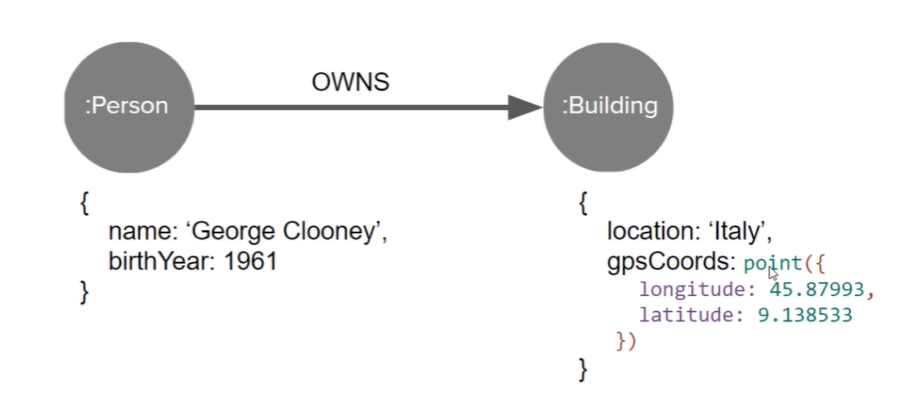

# What is properties?

- neo4j does not support nested properties
- Key-Value pairs on a Node / Relationship



Supported Value Types

- Boolean
- Text
- Numbers (123, 56.70)
- Point (2D, 3D, Lat Lon)
- Temporal (Date, Time, DateTime)
- Lists (list items must all be same type)

---

# Cypher

- A text based declarative language used for querying neo4j database
- declarative language is a high level language that describes what a computation should perform
  - follows strict semantic rules and structured in a particular way

SQL vs Cypher

- Example retrieve all employees

```
SELECT * FROM Employee

MATCH(n:EMPLOYEE) RETURN n
```

---

# Cypher Core Concepts

- Fundamentally, a Neo4j database consists of three core entities
  - nodes
  - relationships
  - paths

`Nodes`

- are data entities in Neo4j, and are referred to in Cypher using `()` parenthesis

```
MATCH (n: Person {name: 'Anna'})
RETURN n.born AS birthYear
```

`Relationships`

- must have a start node, end node and exactly one type

```
MATCH(:Person {name: 'Anna'})-[r:KNOWS WHERE r.since < 2020]->(friend:Person)

RETURN count(r) AS numberOfFriends
```

Note that while nodes can have several labels, relationships can only have one type

`Paths`

- consists of connected nodes and relationships

```
MATCH (n:Person {name: 'Anna'})-[:KNOWS]-{1,5}(friend:Person WHERE n.born < friend.born)
RETURN DISTINCT friend.name AS olderConnections
```

This example uses a `quantified relationship` to find all paths up to `5` hops away. Traversing only relationships of type `KNOWS` from the start node `Anna` to other older `Person` nodes. The `DISTINCT` operator is used to ensure that the `RETURN` clause only returns unique nodes.

Paths can also be assigned variables. For example, the below query binds a whole path pattern, which matches the shortest path from Anna to another Person node in the graph up to 10 hops away with the nationality property set to Canadian. In this case, the RETURN clause returns the full path between the two nodes.

```
MATCH p=shortestPath((:Person {name: 'Anna'})-[:KNOWS*1..10]-(:Person {nationality: 'Canadian'}))
RETURN p
```

---

# Neo4j Internals

A Graph database mainly performs two functions on behalf of its users

- Queries graph data performantly
- Stores graph data safely

`Query Processing`

- To query knowledge graphs performantly, graph database must make traversals (act of moving from one node across a relationship to another node) very fast (or low latency) and cheap (for high concurrent throughput)

- Neo4j stores structure of a graph (nodes and relationships) separately from the property data.

- The graph structure is stored as fixed-length records: one store for nodes and a similar one for relationships. Multiplying the ID of a record by its size in bytes gives you its offset in corresponding store file.

- Makes use of index-free adjacency
